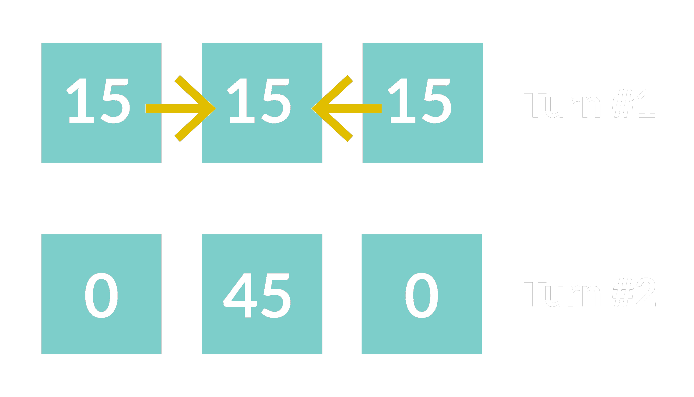
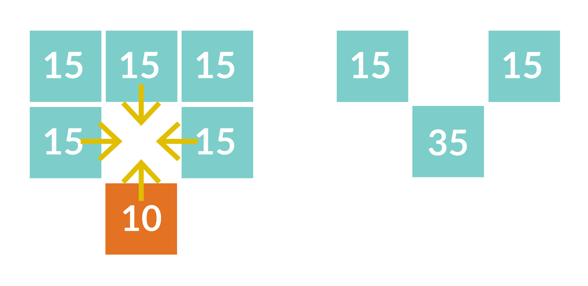
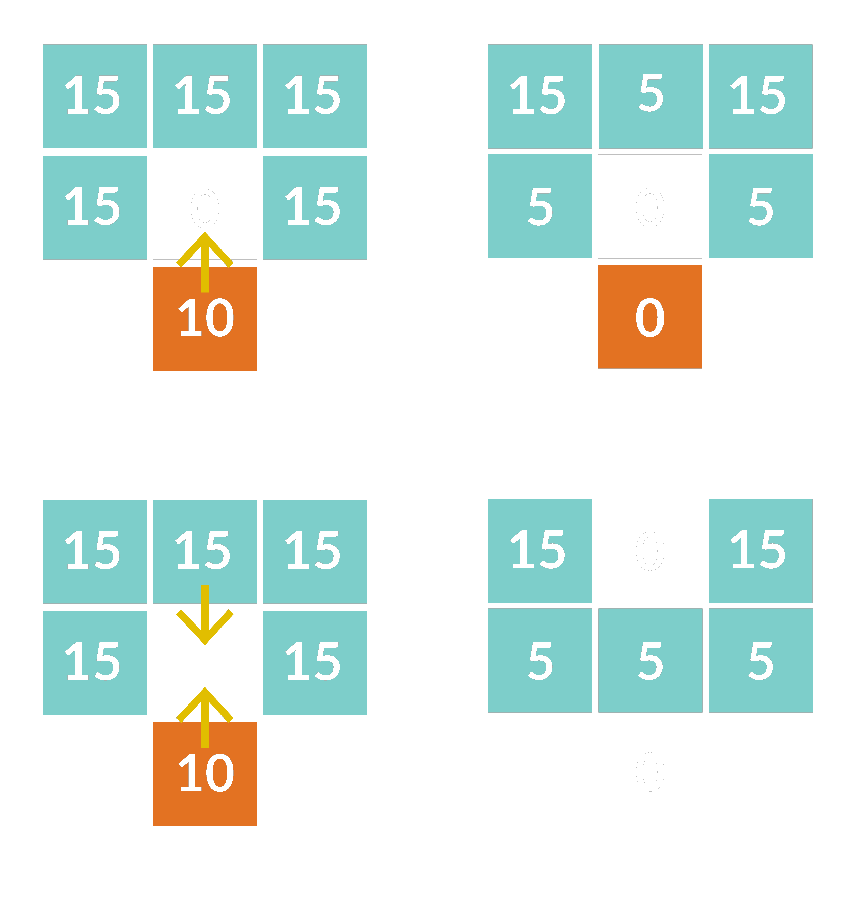

# Blitz2018
The CoveoBlitz 2018 backend 

# How To Build

```
cd blitz2k18
make
```

## Help
`./blitz2k18 -h`

# Getting Started
## Starter Packages
Each starter package consists of a zip file that includes:
 * One code template for your your first bot (the MyBot file)
 * One code sample for a random bot (the RandomBot file)
 * Some support libraries for the bot
 * Some tools to test your bot locally

## Game Environment
Run the game compiled in `blitz2k18` at the root directory of your starter package

# Rules
## Basic Rules
The competition is played on a rectangular grid. Players own pieces on this grid. Some pieces are unowned and so belong to the map until claimed by players. Each piece has a strength value associated with it.

At each turn, bots decide how to move the pieces they own. Valid moves are: STILL, NORTH, EAST, SOUTH, WEST. When a piece remains STILL, its strength is increased by the production value of the site it is on. When a piece moves, it leaves behind a piece with the same owner and a strength of zero.
When two or more pieces from the same player try to occupy the same site, the resultant piece gets the sum of their strengths (this strength is capped at 255).



When pieces with different owners move onto the same site or cardinally adjacent sites, the pieces are forced to fight, and each piece loses strength equal to the strength of its opponent. When a player's piece moves onto an unowned site, that piece and the unowned piece fight, and each piece loses strength equal to the strength of its opponent.

When a piece loses all of its strength, it dies and is removed from the grid.

## Detailed rules 

When pieces from opposing players try to occupy either the same or cardinally adjacent sites (diagonals are not included), the battle will be resolved according to the relative strengths of the pieces, as each piece decreases the strength of every adjacent or coinciding opposing piece by its own strength. Pieces with a strength of 0 or less are removed from the game, excepting pieces with a strength of 0 which have not engaged in combat during that turn.



Notice how in the above example, the pieces combined prior to fighting.

Because a piece damages all adjacent enemy pieces, if a piece is killed while attacking multiple pieces, it will output (often significantly) more damage than it had strength. This is referred to as "overkill" and means that bots can use their pieces tactically to their own advantage. This is shown in the below examples:



The map is initialized by the environment to have productions and strengths. Combat with map squares works identically to combat with other players except only applies on that square; empty map squares neither apply damage to nor take damage from adjacent squares.

Players should note that the map does wrap around; if a piece at the top of the map moves North, it will reappear on the bottom of the map, and pieces on the top and bottom of the map will engage in combat (provided that they are in the same column).

The origin of the map (the point at coordinates (0, 0)) is the north west (top left) corner of the map.

Players are scored according to the reverse of the order in which they are destroyed. The player last standing wins, whereas the player which was destroyed first comes in last. Bots are scored relatively; in a game with many players it is far better to come in second than to come in last.

The game ends if one of two conditions are met:

 * Only one player has any pieces left.
 * 10 * sqrt(WIDTH * HEIGHT) turns have been played. Consequently, a small map may end after a few hundred turns, whereas a large map could take thousands.

The maximum number of turns is generally high enough that only the best-matched of bots will reach the turn limit; the majority of games will end before the turn limit is reached. In the event that the turn limit is reached or multiple bots are destroyed on the same turn, they are ranked based on their territory at that point in the game. If there is a tie in the amount of territory each bot possesses, the full territory integral is used as the tiebreaker, although this is a rare occurence.

## Fog Of War
Bots can only see in an area around them, not the full map. The environment will only send them the information for the space where they have pieces and 2 around. Each turn, they will get a new map which will include the new visible territoty. Fogged territory will be given with neutral values to the bots (Neutral territory, Production 0 and Strength 0).

## Bot Initialization
At the start of the game, each bot is sent some information (accessed using getInit in the starter packages):

 * Their own tag within the map - that is, which player they are.
 * The initial map state.

Bots are permitted to use time at the beginning of the game to initialize. This initialization might include (but is in no way limited to) getting the initial map and player tag, identifying important, high-production regions, planning the bot's initial expansion strategy, and/or compiling a model. Once bots are done initializing (before their time is up), they should send a response (sendInit in the starter packages).

## Turns
After all bots have finished setting up, the environment will do the following until endgame conditions are met.

 1. Send the present gamestate - map and messages - to all players.
 1. Receive moves from the players.
 1. Kill bots whose responses take longer than their remaining allotted time.
 1. Add strength to pieces which choose to remain where they are.
 1. Simultaneously move (and combine if necessary) all player's pieces. The capping of strengths to 255 occurs here.
 1. Simultaneously damage (and remove if damage equals or exceeds strength) all player's pieces. All pieces will output damage equivalent to their strength when starting this phase, and the damage will apply to all coinciding or adjacent enemy squares.
 1. Check if endgame conditions have been met.

## Timeouts
Bots are given 1 second to initialize and 1 second for every subsequent turn. Every bot's clock starts ticking once the environment sends its message (be it initialization or frame) to the bot and resets once the environment receives the newline character marking the end of the bot's response. If a bot's clock hits zero, it is ejected from the game and deemed to have lost. It's pieces become part of the map.

## Maps
Maps are randomly generated at the start of each game. The generator does the following:

 1. Tries to match the given width and height as closely as it can while still creating a symmetric map. Maps are guaranteed to be the given size or smaller in each dimension; never larger.
 1. Tries to create interesting maps in which there are patches of high production squares and patches of low production squares, with fairly low noise on the small scale.
 1. Always creates symmetric maps. Specifically, the generator generates a chunk of the map and then tesselates, reflects, and shifts it to produce the entire map.

# Credits
This code is based on the Halite solution: https://github.com/HaliteChallenge/Halite
